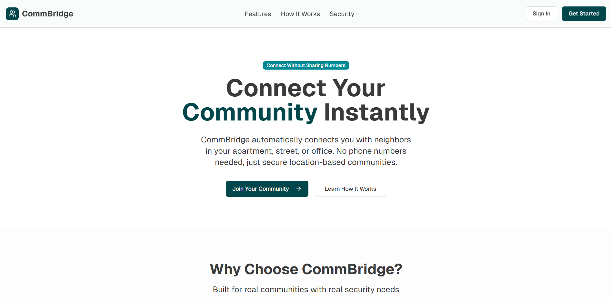

# 🌉 CommBridge: A Real-Time Communication Platform

CommBridge is a modern, full-stack, real-time messaging application designed to connect communities. Built with Next.js and powered by Google Firebase, it provides a seamless and interactive chat experience with a focus on performance and usability.

**[➡️ Link to Live Demo]** 



---

## 📝 Table of Contents

- [About The Project](#-about-the-project)
- [Key Features](#-key-features)
- [Tech Stack](#-tech-stack)
- [Getting Started](#-getting-started)
- [Environment Variables](#-environment-variables)
- [Deployment](#-deployment)
- [Contact](#-contact)

## 📖 About The Project

CommBridge aims to provide a reliable and feature-rich platform for users to create or join communities and engage in meaningful, real-time conversations. The project leverages a serverless architecture with Google Firebase, ensuring scalability and low-latency communication. The frontend is built with Next.js for a fast, server-rendered React experience.

This project serves as a showcase of modern web development practices, including component-based UI, real-time database integration, and secure user authentication.

## ✨ Key Features

-   **Real-Time Messaging:** Instantaneous message delivery using Firebase Firestore listeners.
-   **Secure Authentication:** Robust user login and registration managed by Firebase Authentication.
-   **Community/Channel Creation:** Users can create new communities or join existing ones.
-   **User Profiles:** Customizable user profiles with display names and avatars.
-   **Responsive Design:** A mobile-first, fully responsive UI built with Tailwind CSS and shadcn/ui.
-   **Loading Skeletons:** Smooth user experience with skeleton loaders for data-fetching states.
-   **Theme Customization:** Light and Dark mode support.

## 🛠️ Tech Stack

This project is built with a modern and powerful set of technologies:

-   **Framework:** [Next.js](https://nextjs.org/)
-   **Language:** [TypeScript](https://www.typescriptlang.org/)
-   **Styling:** [Tailwind CSS](https://tailwindcss.com/)
-   **UI Components:** [shadcn/ui](https://ui.shadcn.com/)
-   **Backend & Database:** [Google Firebase](https://firebase.google.com/)
    -   **Firestore:** Real-time NoSQL database.
    -   **Firebase Authentication:** User management and security.
    -   **Firebase Storage:** File uploads (e.g., profile pictures).
-   **Package Manager:** [pnpm](https://pnpm.io/)

## 🚀 Getting Started

To get a local copy up and running, follow these simple steps.

### Prerequisites

Make sure you have Node.js (v18 or later) and pnpm installed on your machine.
-   **Node.js:** [https://nodejs.org/](https://nodejs.org/)
-   **pnpm:**
    ```sh
    npm install -g pnpm
    ```

### Local Setup

1.  **Clone the repository:**
    ```sh
    git clone (https://github.com/Pardhu52/CommBridge.git)
    ```
2.  **Navigate into the project directory:**
    ```sh
    cd CommBridge
    ```
3.  **Install dependencies:**
    ```sh
    pnpm install
    ```
4.  **Set up environment variables:**
    -   Create a file named `.env.local` in the root of the project.
    -   Copy the variables from the section below into `.env.local`.
    -   Fill in your actual Firebase project credentials.

5.  **Run the development server:**
    ```sh
    pnpm dev
    ```
    Open (http://localhost:3000) with your browser to see the result.

## 🔑 Environment Variables

To run this project, you will need to add the following environment variables to your `.env.local` file. You can get these from your Firebase project console.

```env
# Firebase Configuration
NEXT_PUBLIC_FIREBASE_API_KEY="your_api_key"
NEXT_PUBLIC_FIREBASE_AUTH_DOMAIN="your_auth_domain"
NEXT_PUBLIC_FIREBASE_PROJECT_ID="your_project_id"
NEXT_PUBLIC_FIREBASE_STORAGE_BUCKET="your_storage_bucket"
NEXT_PUBLIC_FIREBASE_MESSAGING_SENDER_ID="your_sender_id"
NEXT_PUBLIC_FIREBASE_APP_ID="your_app_id"

📦 Deployment
The easiest way to deploy this Next.js application is to use the Vercel Platform.

Alternatively, you can use Firebase Hosting to keep your entire stack within the Firebase ecosystem.

👤 Contact
Pardhu

GitHub: @Pardhu52

LinkedIn: www.linkedin.com/in/pardha-saradi-raju-ayenampudi-058a882bb
